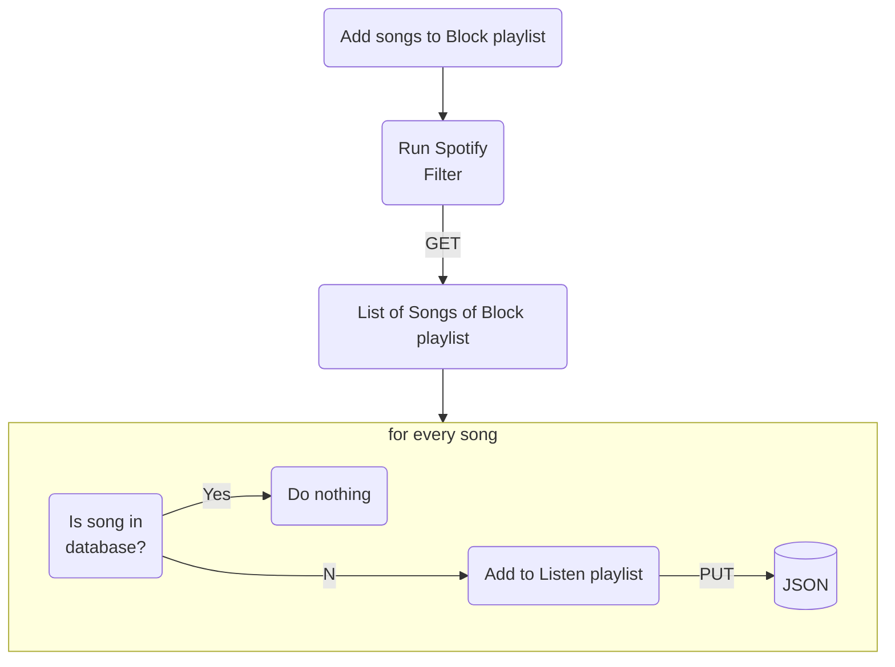

# Spotify Filter

Tired of listening to the same songs over and over again?

### How it works

Just create two playlists on spotify. One that will act as a filter and one from which to listen only new songs. Add all
the songs you want to listen to in the **BLock** playlist.
Now you run Spotify Filter. The songs in **Block** playlist will be compared with those in the `listened.json` file (
which contains the songs already listened to). If they were already present (already listened) they will be filtered.
The new ones, on the other hand, will be moved to the **Listen** playlist, on which you will always find only new
songs (never listened).



### Instructions

1. Create two playlists on Spotify:
    - **Block** playlist
    - **Listen** playlist
2. Execute `pip install -r requirements.txt`
3. Inside the `src/` directory you need to create a `config.py` file with the following structure:
   ```python
   SPOTIPY_CLIENT_ID = ''
   SPOTIPY_CLIENT_SECRET = ''
   PLAYLIST_BLOCK_ID = ''
   PLAYLIST_LISTEN_ID = ''
   ```
4. Create an [app](https://developer.spotify.com/dashboard/login). Inside the settings of that app,
   add `https://www.google.com/` as a **Redirect URIs**.
5. Copy Client ID and Client Secret of that app in the `config.py`. Add the playlists id in the same file.